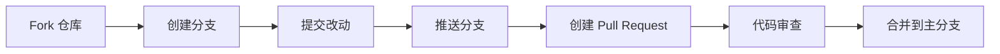

# ✉️ 邮件模板编辑器 | Email Template Editor

<div align="center">


**一个优雅的邮件模板编辑器，帮助你快速编写和管理专业邮件内容**  
*基于 Nuxt 3 构建，支持富文本编辑、模板管理和一键复制*

[✨ 特性](#-特性) •
[🚀 快速开始](#-快速开始) •
[📦 部署指南](#-部署指南) •
[🎯 使用技巧](#-使用技巧) •
[🤝 贡献指南](#-贡献指南)


</div>

## ✨ 特性

<table>
  <tr>
    <td width="50%">
      <h3>📝 强大的富文本编辑</h3>
      <ul>
        <li>完整的文本格式化工具</li>
        <li>多种对齐方式</li>
        <li>标题级别和字体大小控制</li>
        <li>有序和无序列表</li>
      </ul>
    </td>
    <td width="50%">
      <h3>🎨 丰富的样式选项</h3>
      <ul>
        <li>内置多种预设颜色</li>
        <li>支持自定义文字和背景颜色</li>
        <li>精确的RGB值调整</li>
        <li>一键清除格式</li>
      </ul>
    </td>
  </tr>
  <tr>
    <td width="50%">
      <h3>💾 便捷的模板管理</h3>
      <ul>
        <li>多种预设专业邮件模板</li>
        <li>一键套用模板</li>
        <li>模板实时预览</li>
        <li>模板搜索功能</li>
      </ul>
    </td>
    <td width="50%">
      <h3>📋 智能复制功能</h3>
      <ul>
        <li>支持复制全文/仅标题/仅内容</li>
        <li>保留文字格式和样式</li>
        <li>兼容各种邮件客户端</li>
        <li>复制成功提示</li>
      </ul>
    </td>
  </tr>
</table>

## 🚀 快速开始

### 环境要求

- Node.js 16.x 或更高版本
- pnpm 8.x 或更高版本

### 安装与运行

```bash
# 克隆仓库
git clone https://github.com/yourusername/email-template-editor.git
cd email-template-editor

# 安装依赖
pnpm install

# 开发模式
pnpm dev

# 构建项目
pnpm build

# 预览构建结果
pnpm preview
```

<details>
<summary><b>📱 移动端支持</b></summary>
<br>
邮件模板编辑器完全支持移动端设备，提供了响应式设计和触摸友好的界面：

- 自适应布局，适配各种屏幕尺寸
- 针对触摸操作优化的工具栏
- 移动端特有的交互模式
- 流畅的动画和过渡效果

无论是在桌面端还是移动端，都能获得一致且优质的使用体验。
</details>

## 📦 部署指南

### 使用 PM2 部署（推荐）

<details open>
<summary><b>详细步骤</b></summary>

#### 1. 构建项目

```bash
pnpm build
```

#### 2. 上传到服务器

```bash
# 创建远程目录（如果需要）
ssh user@your-server "mkdir -p /path/to/app"

# 上传构建文件和配置
scp -r .output ecosystem.config.cjs user@your-server:/path/to/app/
```

#### 3. 创建 PM2 配置文件

创建 `ecosystem.config.cjs`：

```javascript
module.exports = {
  apps: [{
    name: 'email-editor',
    script: '.output/server/index.mjs',
    instances: 1,
    autorestart: true,
    watch: false,
    max_memory_restart: '1G',
    env: {
      NODE_ENV: 'production',
      PORT: 3003,        // 指定运行端口
      HOST: '0.0.0.0'    // 允许外部访问
    }
  }]
}
```

#### 4. 使用 PM2 启动应用

```bash
# 安装 PM2
npm install -g pm2

# 启动应用
pm2 start ecosystem.config.cjs

# 设置开机自启
pm2 startup
pm2 save
```

</details>

### 使用 Docker 部署

<details>
<summary><b>详细步骤</b></summary>

#### 1. 创建 Dockerfile

```dockerfile
FROM node:18-alpine

WORKDIR /app

COPY .output .
COPY package.json .

EXPOSE 3000

CMD ["node", ".output/server/index.mjs"]
```

#### 2. 构建并运行 Docker 镜像

```bash
# 构建镜像
docker build -t email-editor .

# 运行容器
docker run -d -p 3003:3000 --name email-editor email-editor
```

</details>

## 🎯 使用技巧

<div align="center">
  <table>
    <tr>
      <th>功能</th>
      <th>描述</th>
      <th>快捷键/提示</th>
    </tr>
    <tr>
      <td>📝 文本格式化</td>
      <td>快速应用常用文本格式</td>
      <td><kbd>Ctrl</kbd> + <kbd>B</kbd> (加粗)<br><kbd>Ctrl</kbd> + <kbd>I</kbd> (斜体)<br><kbd>Ctrl</kbd> + <kbd>U</kbd> (下划线)</td>
    </tr>
    <tr>
      <td>🎨 颜色选择</td>
      <td>应用和自定义颜色</td>
      <td>使用预设颜色快速应用<br>通过RGB值精确调整</td>
    </tr>
    <tr>
      <td>📋 复制功能</td>
      <td>灵活的内容复制选项</td>
      <td>全文复制<br>仅标题复制<br>仅内容复制</td>
    </tr>
    <tr>
      <td>📱 移动端使用</td>
      <td>在移动设备上高效使用</td>
      <td>使用分类工具栏<br>点击模板按钮快速切换</td>
    </tr>
  </table>
</div>

## 🤝 贡献指南

我们欢迎各种形式的贡献，无论是新功能、bug修复还是文档改进！



1. Fork 本仓库
2. 创建特性分支：`git checkout -b feature/amazing-feature`
3. 提交改动：`git commit -m 'Add amazing feature'`
4. 推送分支：`git push origin feature/amazing-feature`
5. 提交 Pull Request

## 📄 许可证

本项目采用 [MIT 许可证](LICENSE) 进行许可。

## 🙏 鸣谢

<div align="center">
  <a href="https://nuxt.com/" target="_blank"></a>
  <a href="https://tailwindcss.com/" target="_blank"></a>
  <a href="https://fontawesome.com/" target="_blank"></a>
</div>

---

<div align="center">
  <sub>Made with ❤️ by yama</sub>
  <br><br>
  <a href="#-邮件模板编辑器--email-template-editor">⬆️ 返回顶部</a>
</div>
